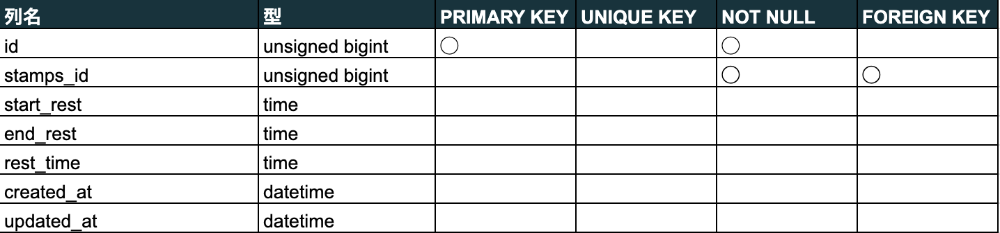

# Atte（アット）
AtteはWeb上で出勤、退勤および休憩の勤怠状況を管理できるサービスです。


## 作成した目的
人事評価のため作成しました。制作目標は利用者数100人達成です。

## アプリケーションURL
<http://13.231.44.24/>
ログイン前はログイン画面に移行します。会員登録を行なっていない場合は、登録後に使用できます。
## 他のレポジトリ

## 機能一覧
・会員登録機能
・ログイン機能
・ログアウト機能
・勤務開始機能
・勤務終了機能
・休憩開始機能
・休憩終了機能
・日付別勤怠情報取得機能
・ユーザー一覧機能
・ユーザーごとの勤怠情報取得機能
・ページネーション機能

## 使用技術（実行環境）
- PHP 8.2.9
- Laravel 8.83.8
- MySQL 8.1.0
- Nginx 1.22.1
- AWS
  - EC2
  - RDS
  - S3

## テーブル設計
Usersテーブル


Stampsテーブル


Restsテーブル


## ER図


## 環境構築
#### プロジェクトのセットアップ手順
##### ディレクトリの作成
アプリケーションを作成するために、開発環境を GitHub からクローンします。
`laravel-docker-template.git`をクローンしてください。
```bash
$ git clone git@github.com:coachtech-material/laravel-docker-template.git
```
##### Docker の設定
次に、Docker の設定を行なっていきます。
複数のコンテナを扱うのでdocker-composeを使います。
```bash
$ docker-compose up -d --build
$ code .
```
##### Laravel のパッケージのインストール
docker-composeコマンドで PHPコンテナ内にログインし、composerコマンドを使って必要なパッケージをインストールします。
```bash
$ docker-compose exec php bash
$ composer install
```
##### .envファイルの作成
.envファイルは、.env.exampleファイルをコピーして作成しましょう。
```bash
cp .env.example .env
exit
```
.envファイルは以下のように修正します。
```
// 前略
DB_CONNECTION=mysql
DB_HOST=mysql
DB_PORT=3306
DB_DATABASE=laravel_db
DB_USERNAME=laravel_user
DB_PASSWORD=laravel_pass
// 後略
```
##### viewファイルの作成
各ページのviewファイルを作成します。
resources/viewsに、以下4つのBladeファイルを作成します。
- index.blade.php
- attendance.blade.php
- user.blade.php
- user_information.blade.php

また、resources/views/authに以下3つのBladeファイルを作成します。
- login.blade.php
- register.blade.php
- verify-email.blade.php

さらに、resources/views/layoutsに以下のBladeファイルを作成します。
- app.blade.php

##### cssファイルの作成
cssファイルを作成します。
public/cssに以下9つのファイルを配置してください。
- index.css
- attendance.css
- user.css
- user_information.css
- login.css
- register.css
- verify-email.css
- app.blade.css
- sanitize.css